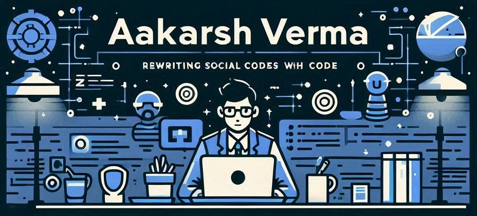

## Rapid-fire

<table><tr><td valign="top" width="50%">

- 📫 How to reach me **developer.aakarshverma@gmail.com**

- 🔭 I’m currently building [SinQlarity](https://beta.sinqlarity.com/)

- ❓ Ask me about anything related to MERN stack and related technologies

</td><td valign="top" width="50%">

</td></tr></table>

## 🌐 Socials:

 

# 💻 Tech Stack:

                               

# 📊 GitHub Stats:

 

 

 

## 🏆 GitHub Trophies

### 🔝 Top Contributed Repositories

### 🔝 Top Repository

    
